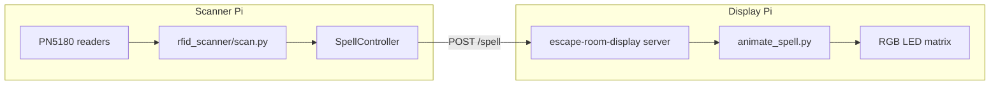

# Copperdragons — project overview

Physical escape room puzzle: RFID-tagged props on a **table** trigger LED matrix animations when arranged correctly.

## Puzzle concept

The room has **reader spots on a table** (POC: **2**, production likely **3**), each with a **PN5180 NFC/RFID reader** — colocated, so **one scanner Pi for all readers** is preferred. Players place **physical items** (props with ISO 14443-A stickers) on those spots. Each item type corresponds to an **element** (e.g. fire, air, ice).

When the **combination of elements** across all spots matches a configured rule, the **LED screen** plays an **animation** (“spell”). Example: fire + air → `fireball`. Different combinations → different spells.

Players reference a physical **spellbook** in the room (analog prop, not software) for which combinations cast which spells.

**Idle behaviour:** no default animation. The panel is blank until a combo fires. After the spell animation **finishes**, it returns to idle.

**Future (out of scope today):** spells may eventually trigger physical room effects (e.g. conjure clothes → clothing drops). For now, spells only drive LED animations.

The puzzle is intentionally **physical-first**: players manipulate objects; software only observes and reacts.

## Current operational mode

**Test mode** — not combo mode yet. One reader at a time via `--test-scanner`; `tag_spells.json` maps UID → spell directly. Used to validate PN5180 → display Pi path before enabling multi-reader combos.

```bash
python rfid_scanner/src/scan.py \
  --test-scanner A \
  --display-url http://raspberrypi:8765 \
  --tag-spells rfid_scanner/tag_spells.json
```

Combo mode (below) is the **production target** once hardware supports multiple readers on one Pi.

## Deployment architecture

### Scanner node — 1× Raspberry Pi 4 (`cde@copperdragons3`)

- Connect **2× PN5180** for POC (3× eventually) over SPI on **one Pi** (preferred; pending library support).
- Readers are **side by side on the same table**.
- Run `rfid_scanner/src/scan.py`.
- Continuously poll for NFC tags at each reader.
- Maintain per-scanner state (which element is present).
- When combo rules match, **HTTP POST** to the display Pi.

Typical command **(target — not current)**:

```bash
python rfid_scanner/src/scan.py \
  --scanner A --scanner B \
  --display-url http://raspberrypi:8765 \
  --tag-spells rfid_scanner/tag_spells.json \
  --combo-spells rfid_scanner/combo_spells.json
```

See [rfid_scanner/README.md](../rfid_scanner/README.md) for wiring, SPI setup, and troubleshooting.

### Display node — 1× Raspberry Pi 4 (`cde@raspberrypi`)

- Connect **32×32 RGB LED matrix HAT** (via `external/rgb-matrix` / hzeller driver).
- Run `escape-room-display/` as a small HTTP service (port 8765).
- On `POST /spell`, spawn the animation runner as a subprocess; stop any current animation first.

```bash
uvicorn server:app --host 0.0.0.0 --port 8765
```

See [escape-room-display/README.md](../escape-room-display/README.md) for API and systemd setup.

### Network

Scanner and display Pis are separate hosts (often on Tailscale). Only requirement: scanner can reach `http://<display-host>:8765/spell`.

## Configuration model

### Test mode (current)

**`tag_spells.json`** — maps NFC UID → spell name directly:

```json
{
  "63aa5531": "void",
  "95789bae": "fireball"
}
```

Run with `--test-scanner A`. No `combo_spells.json` needed.

### Combo mode (production target)

Two JSON files drive combo behaviour:

**`tag_spells.json`** — maps NFC UID → element name:

```json
{
  "63aa5531": "fire",
  "b2f28804": "ice"
}
```

**`combo_spells.json`** — maps full per-scanner state → spell (animation name):

```json
[
  { "match": { "A": "fire", "B": "air"  }, "spell": "fireball" },
  { "match": { "A": "ice",  "B": "fire" }, "spell": "void"     }
]
```

Rules:

- **Every** configured scanner must have a tag present before any combo fires.
- Scanner IDs in `match` must match `--scanner` names.
- **Order matters**: swapping A and B can be a different spell.
- Controller fires on **state transition** into a matching combo (not continuously while held).
- Per-combo **cooldown** prevents rapid re-triggers (`--spell-cooldown`).

Only `combo_spells.example.json` is in the repo so far; create `combo_spells.json` when switching modes.

## Animation system

Animations are **pre-rendered** as JSON frame grids:

```
led_screen/spell_data/<spell>/
  <spell>-frame_0.json
  <spell>-frame_1.json
  ...
  <spell>-colours.json   # palette
```

Current spells in repo: `bubble`, `car`, `cube`, `fire`, `globe`, `loading`, `pirate`, `skull`, `swirl`, `void`, `wheel`, `zipper`.

Runtime entry point: `led_screen/spell_runner/animate_spell.py` (uses `SampleBase` from vendored rgb-matrix).

Offline authoring: `utils/convert-image-to-rgb/` converts GIF sources into frame JSON.

## Data flow diagram



## Repository map

```
copperdragons/
├── rfid_scanner/           # Scanner-side: readers, combos, HTTP client
├── escape-room-display/    # Display-side: HTTP API, subprocess manager
├── led_screen/
│   ├── spell_runner/       # Matrix animation code
│   └── spell_data/         # Frame JSON per spell
├── utils/convert-image-to-rgb/  # Asset pipeline (dev-time)
├── external/
│   ├── pyPN5180/           # PN5180 driver (vendored)
│   └── rgb-matrix/         # LED matrix driver (vendored)
├── scripts/setup.sh        # Environment setup
└── docs/                   # Plans and project docs
```

## Known limitations

| Limitation | Detail |
|------------|--------|
| One PN5180 per Pi (today) | pyPN5180 hard-codes SPI0 CE0 + GPIO 25 BUSY — blocks preferred 2–3 readers on one table Pi |
| Physical spell effects | Designed for later; animations only today |
| Path naming drift | Older docs reference `led_screen/spells/spell.py` and `spell-data`; repo uses `spell_runner/animate_spell.py` and `spell_data/` |
| No scanner systemd unit | Display has `escape-room-display.service`; scanner auto-start is manual |
| ISO 14443-A only | ISO 15693 tags need different library API |

## Related docs

- [AGENTS.md](../AGENTS.md) — concise context for AI assistants (read first)
- [rfid_scanner/README.md](../rfid_scanner/README.md) — PN5180 wiring and scanner CLI
- [escape-room-display/README.md](../escape-room-display/README.md) — HTTP API and display setup
- [docs/plans/trim-rgb-matrix-vendor.md](plans/trim-rgb-matrix-vendor.md) — vendored rgb-matrix maintenance plan
