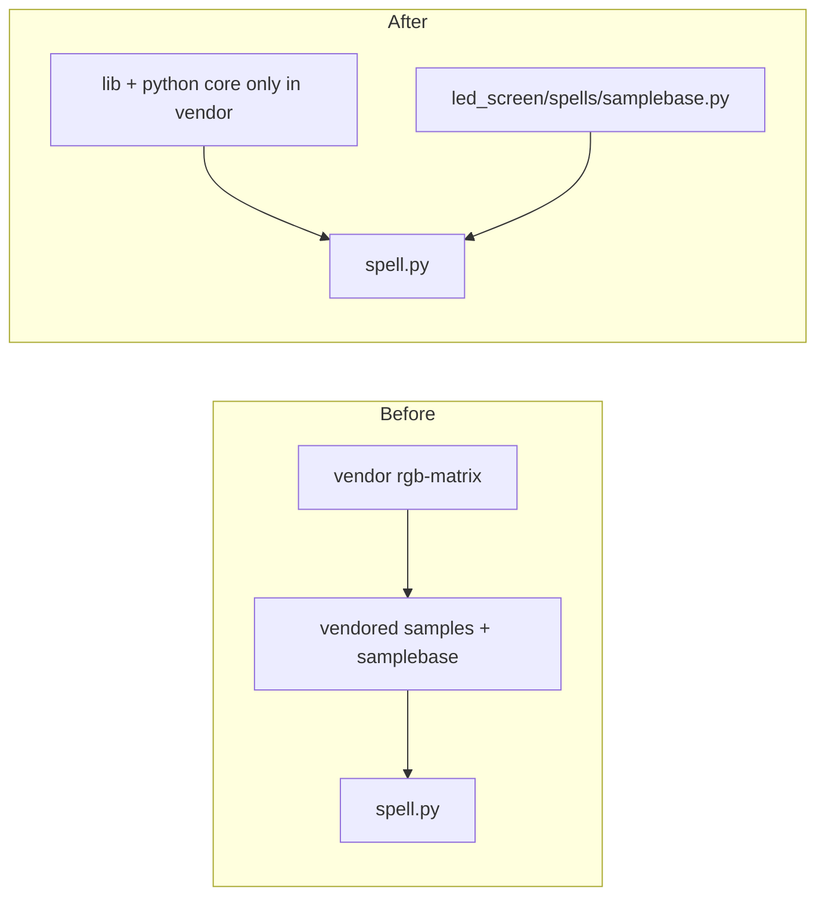

# Trim `external/rgb-matrix` for Copperdragons

## What actually depends on this tree

- **[scripts/setup.sh](scripts/setup.sh)** runs `make -C external/rgb-matrix build-python`, then `pip install -e external/rgb-matrix/bindings/python`, then `pip install -e external/rgb-matrix/bindings/python/samples`.
- **[led_screen/spells/spell.py](led_screen/spells/spell.py)** imports `SampleBase` from `samplebase` and uses only **`RGBMatrix` / `RGBMatrixOptions`**, **`CreateFrameCanvas()`**, **`SwapOnVSync()`**, and **`SetPixel`** — i.e. the Python **`core`** binding, not `rgbmatrix.graphics`.
- **[escape-room-display/](escape-room-display/)** does not import `rgbmatrix`; it only runs `spell.py` as a subprocess ([spell_runner.py](escape-room-display/spell_runner.py)).

The C library build is defined in [external/rgb-matrix/lib/Makefile](external/rgb-matrix/lib/Makefile) (single `librgbmatrix` from `gpio.o`, `led-matrix.o`, `framebuffer.o`, `graphics.o`, `bdf-font.o`, etc.). **`graphics.cc` / `bdf-font.cc` / `content-streamer.cc` are linked into the shared library** and referenced from `framebuffer.cc`, `led-matrix-c.cc`, etc. **Removing those `.cc` files without a careful fork is high-risk** and saves less disk than deleting demos/adapters. This plan **does not** slim the C object list unless you explicitly want a maintenance-heavy fork later.

## Recommended removals (safe, large impact)

Delete entire directories that are not needed to build `lib/librgbmatrix` or the Python `core` extension:

| Path | Rationale |
|------|-----------|
| [external/rgb-matrix/adapter/](external/rgb-matrix/adapter/) | KiCad projects, zips, passive/active PCB docs — not used at runtime |
| [external/rgb-matrix/bindings/c#/](external/rgb-matrix/bindings/c#/) | Alternate language binding |
| [external/rgb-matrix/examples-api-use/](external/rgb-matrix/examples-api-use/) | C++ demos |
| [external/rgb-matrix/utils/](external/rgb-matrix/utils/) | `led-image-viewer`, `text-scroller`, etc. |
| [external/rgb-matrix/.github/](external/rgb-matrix/.github/) | Upstream CI only |

Also remove stray generated metadata under the vendored tree if present (e.g. multiple `*.egg-info` trees under `bindings/python/` and `bindings/python/samples/`) after fixing installs — they should not be source-of-truth.

## Makefile fix (stops building demos on every `build-python`)

In [external/rgb-matrix/Makefile](external/rgb-matrix/Makefile), the `$(RGB_LIBRARY)` target currently runs `$(MAKE) -C examples-api-use` after building `lib/`. **Remove that dependency** so `make build-python` only builds `lib/` + Python bindings. Update `clean` targets to stop referencing removed dirs.

## Move `samplebase` out of the vendor tree

- Copy [external/rgb-matrix/bindings/python/samples/samplebase.py](external/rgb-matrix/bindings/python/samples/samplebase.py) to **[led_screen/spells/samplebase.py](led_screen/spells/samplebase.py)** (same directory as `spell.py`, so `from samplebase import SampleBase` keeps working with `cwd=led_screen/spells` from [spell_runner.py](escape-room-display/spell_runner.py)).
- Delete `external/rgb-matrix/bindings/python/samples/` (all upstream demo scripts and broken/partial `copperdragons.egg-info`).
- **Update [scripts/setup.sh](scripts/setup.sh):** remove the line `pip install -e external/rgb-matrix/bindings/python/samples`.

## Optional: drop unused Python `graphics` extension

[external/rgb-matrix/bindings/python/setup.py](external/rgb-matrix/bindings/python/setup.py) builds two extensions: `core` and `graphics`. [external/rgb-matrix/bindings/python/rgbmatrix/__init__.py](external/rgb-matrix/bindings/python/rgbmatrix/__init__.py) only imports from `core`. You can remove `graphics_ext` and delete `rgbmatrix/graphics.pyx`, `graphics.cpp` (generated), and `graphics.pxd` **if** nothing in your repo imports `from rgbmatrix import graphics`. (Grep confirms spell path does not.) This slightly speeds installs and shrinks the bindings folder; **`librgbmatrix` still contains C++ graphics/font code** — this only removes the Python wrapper.

## Readability: shorten the vendor README

Replace or heavily trim [external/rgb-matrix/README.md](external/rgb-matrix/README.md) with a short **Copperdragons vendor note**: upstream project URL, original commit/hash if known, what was stripped, and how to build (`make build-python`). Keeps legal notice / [COPYING](external/rgb-matrix/COPYING) intact.

## Verification (after implementation)

Treat these as **gates**: fix failures before merging. Order matters least for (1)–(3) on dev vs Pi; **hardware steps need a Pi** (or equivalent Linux + matrix).

### 1. Clean build and install

- Activate the project venv (same as [scripts/setup.sh](scripts/setup.sh)).
- `make -C external/rgb-matrix clean` (optional but catches stale artifacts after deleting dirs).
- `make -C external/rgb-matrix build-python` — must finish without errors; confirm `external/rgb-matrix/lib/librgbmatrix.so.1` (or `.a`) exists.
- `pip install -e external/rgb-matrix/bindings/python` — succeeds; no missing `samples` path if that install was removed from setup.

### 2. Python import sanity

- `python -c "from rgbmatrix import RGBMatrix, RGBMatrixOptions; print('ok')"` — exercises the `core` extension load against `librgbmatrix`.
- From repo root: `python -c "import sys; sys.path.insert(0, 'led_screen/spells'); from samplebase import SampleBase; print('ok')"` — confirms `samplebase` resolves without the old vendored package.

### 3. Matrix hardware smoke test (Raspberry Pi / production-like)

- `cd led_screen/spells` and run **`sudo python spell.py fireball`** (or `void`), same as production privilege model. Expect: no traceback, animation visible on the panel. Ctrl-C to stop.
- Repeat with the second spell to confirm argv parsing still works.

### 4. Escape-room integration (end-to-end)

- Install/run **escape-room-display** deps ([escape-room-display/requirements.txt](escape-room-display/requirements.txt)) in the same or dedicated venv as used on the Pi.
- Start the FastAPI server the way you deploy it ([escape-room-display/server.py](escape-room-display/server.py)).
- Trigger a spell swap via the real API path you use (e.g. POST/select spell) so **[spell_runner.py](escape-room-display/spell_runner.py)** starts `spell.py` with `cwd=led_screen/spells`. Confirm the display updates and logs show no spawn errors.

### 5. Developer machine without hardware (optional)

- On macOS/Windows, `scripts/setup.sh` skips the C build but still installs the editable binding; **`rgbmatrix` import may fail** — that is expected.
- Confirm **`samplebase` mock path**: run `spell.py` briefly and ensure it uses the `ImportError` mock in [led_screen/spells/samplebase.py](led_screen/spells/samplebase.py) without crashing (matrix operations no-op). Useful for CI or local sanity only, not a substitute for Pi testing.

### Success criteria summary

- **Build/install:** `make build-python` and `pip install -e bindings/python` succeed on Linux.
- **Binding load:** `from rgbmatrix import RGBMatrix, RGBMatrixOptions` works where `.so` is built.
- **Panel:** `sudo spell.py <spell>` runs on the Pi with visible output.
- **Integration:** escape-room server can swap spells and the subprocess keeps working.

## Architecture (current vs after)

